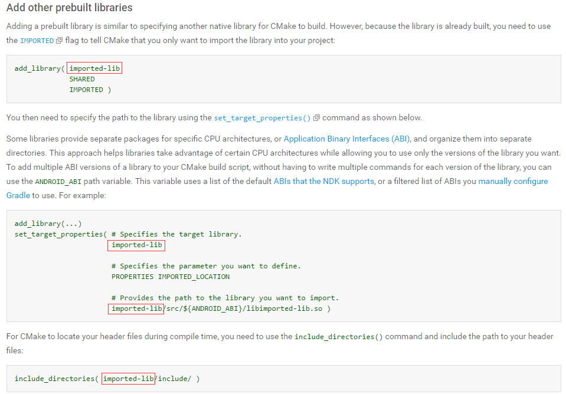
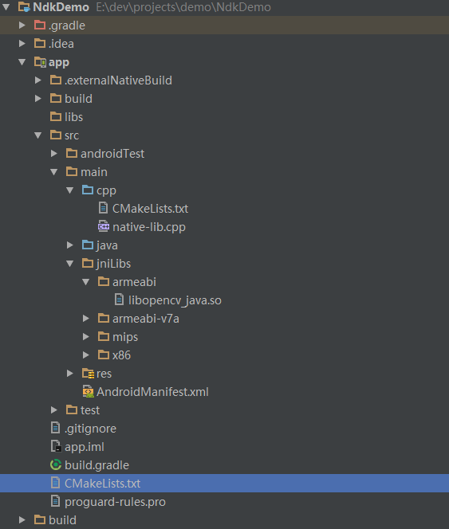
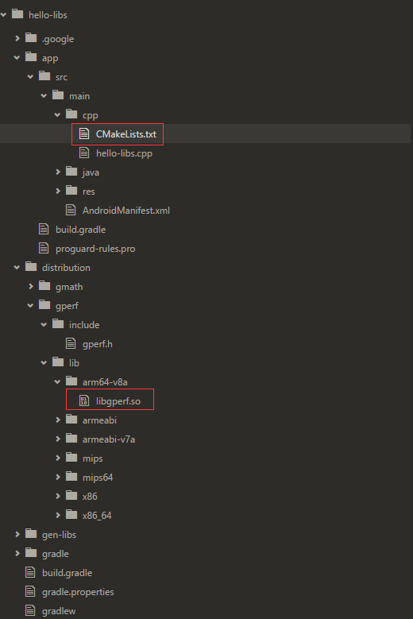

# 开坑Android NDK CMake

> 2016.11.10

## 前言

项目需求，更方便的将c工程打包进Android项目。之前编译动态库的方式有点过时，且不够方便。更新Android Studio 2.2后，发现开始支持CMake编译来进行NDK开发，所以开始趟坑。

## 构建支持CMake的NDK Demo工程

第一步当然是按照[官网文档](https://developer.android.com/studio/projects/add-native-code.html#new-project)的说明，先把Demo工程跑起来，文档非常详细，按照一步步来就能把项目跑起来。

注：链接打不开的话这里有篇[译文](http://wl9739.github.io/2016/09/21/%E5%9C%A8-Android-Studio-2-2-%E4%B8%AD%E6%84%89%E5%BF%AB%E5%9C%B0%E4%BD%BF%E7%94%A8-C-C-md/?utm_source=tuicool&utm_medium=referral)，翻译的不错，只是稍微少了些原文的内容，估计没及时更新，不过绝大部分内容都有了。

但由于对C语言不熟悉，更别提CMake的语法了，所以很快遇到第一个坑。

## 链接动态库

**打包时找不到so库**



上图是文档中关于链接动态库的语法，注意画红圈的地方。

第一个命令是add_library，根据文档前面的描述，的第一个参数应该是定义生成库的名称。

然后是第二命令set_target_properties。第一个参数指定目标库，和add_library中的对应，比较好理解；关键是最后一个参数，按照注释说明指的是待引入动态库的路径，不太明白怎么定义啊，所以就按照文档中一字不漏的敲进去了。当然，我需要用一个真实的so库来测试，所以就用的libopencv_java.so，opencv的一个动态库。

build顺利通过，打包apk时报错了：

```
Error:error: 'imported-lib/src/mips/libopencv_java.so', needed by '../obj/mips/libnative-lib.so', missing and no known rule to make it
```

根本就找不到这个so库好吧。。。

然后就是各种google、stackoverflow，更乱了，因为每个人情况都不太一样，工程目录也是千差万别，而且这应该是一个很基本的问题，所以每人对这个进行详细说明。

各种绕圈后终于发现，set_target_properties的最后一个参数，只要指定so库的路径让CMake在编译时可以找到就可以了。如果你想，完全可以用绝对路径，比如这样的：“E:/dev/projects/demo/NdkDemo/app/src/main/jniLibs”，没有问题，只不过项目源码换地儿就得改罢了。我们是有追求的软件工程师（ma nong），所以我们用相对路径。最终这块的脚本命令是这样的：

```
# 相当于定义变量，引用时使用${var}的形式
set(lib_DIR ${CMAKE_SOURCE_DIR}/src/main/jniLibs)

set_target_properties(
             # Specifies the target library.
             import-lib

             # Specifies the parameter you want to define.
             PROPERTIES IMPORTED_LOCATION

             # Provides the path to the library you want to import.
             # 使用ABI可以根据CPU架构不同打包对应的动态库
             # ${ANDROID_ABI}是为我们预设好的变量，打包时会自动替换成对应的文件夹名称（armeabi、armeabi-v7a等）
             ${lib_DIR}/${ANDROID_ABI}/libopencv_java.so )

include_directories( import-lib/include/ )
```

**CMAKE_SOURCE_DIR的作用**

这里需要着重说明一下${CMAKE_SOURCE_DIR}，这个变量也是CMake预设好的，它指向的是最顶层CMakeLists.txt所在的文件夹的路径。



举例说明：Demo的项目结构如图：CMakeLists.txt只两个，最顶层的在app文件夹下，第二个在app/src/main/cpp文件夹下，所以${CMAKE_SOURCE_DIR}指向的时app这个文件夹的路径，** 无论项目中有几个CMakeList.txt，${CMAKE_SOURCE_DIR}指向的都是最顶层的CMakeList.txt所在的文件夹的路径 ** 。

所以在demo中，定义lib_DIR指向${CMAKE_SOURCE_DIR}/src/main/jniLibs，其实就是指向了NDKDemo/app/src/main/jniLibs这个文件夹，然后在拼接上/${ANDROID_ABI}/libopencv_java.so，就可以找到so库了。

关于${CMAKE_SOURCE_DIR}，[这个回答说的比较明白](http://stackoverflow.com/questions/32028667/are-cmake-source-dir-and-project-source-dir-the-same-in-cmake)。

**指定路径时的俩点**

在Android NDK官方的sample中，看到这样的写法

```
# configure import libs
set(distribution_DIR ${CMAKE_SOURCE_DIR}/../../../../distribution)

add_library(lib_gperf SHARED IMPORTED )
set_target_properties(lib_gperf PROPERTIES IMPORTED_LOCATION
    ${distribution_DIR}/gperf/lib/${ANDROID_ABI}/libgperf.so)
```

这一堆俩点时什么鬼？对照工程布局就明白了。



脚本所在的CMakeList.txt文件位于hello-libs/app/src/main/cpp文件夹下，而动态库位于hello-libs/distribution/gperf/lib/${ANDROID_ABI}文件夹下。所以俩点和cd命令行中的作用一样：**向上进入父文件夹**。

## 链接Opencv4Android库

** TO BE CONTINUE **

> 转载请注明出处：[开坑Android NDK CMake](https://github.com/LandChanning/DevNote/blob/master/2016.11.10-%E5%BC%80%E5%9D%91Android%20NDK%20CMake.md)
