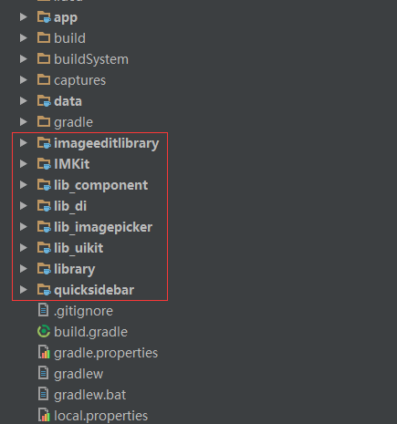
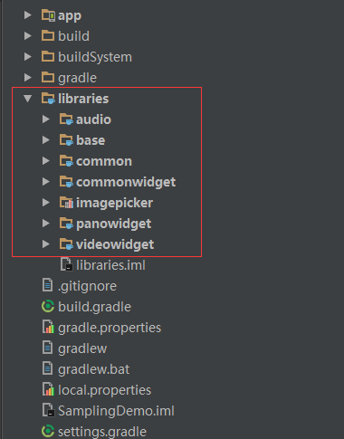
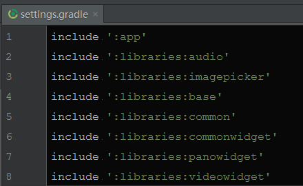
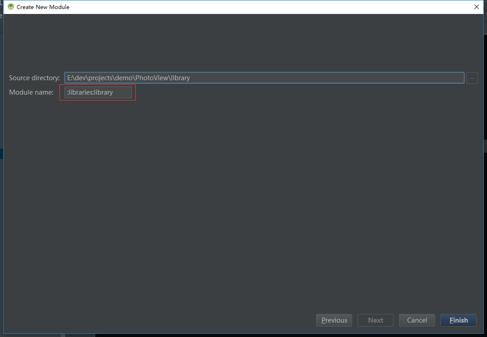
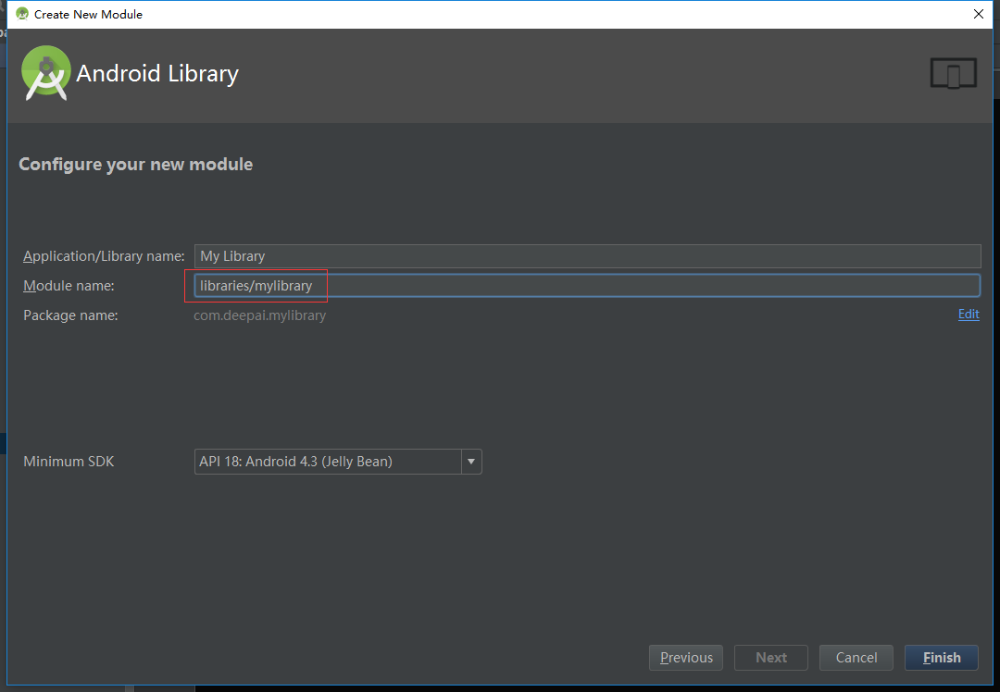
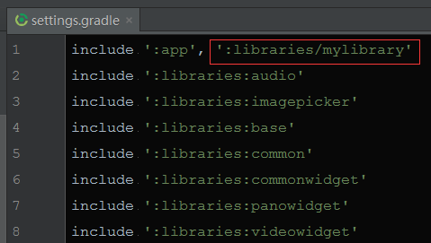

# Project视图下多module归类合并 #

使用Android Studio开发项目一般会依赖多个module，如果module太多的话，在project面板下会显得非常乱，而且不方便查找管理。

最开始尝试强行将这些module拖到一个文件夹下，但是编译就报错了（肯定不是这么无脑啦），一直也没找到好的解决办法，所以就把module的name都加上lib前缀，好山寨的感觉。如下图所示：

直到前几天在google的一个sample中发现，真的可以将modele归档，关键的是项目根目录下的settings.gradle脚本。

## 归档项目中已有的module ##

具体修改很简单，首先在project下新建目录，比如叫libraries，然后将要归档的module直接拖进去，如下图所示：

最后也是最关键的一步，修改settings.gradle脚本。

不知道大家有没有从上图中看出该脚本语句的关键点？其实就是使用“:”号将module和它的父文件夹分隔开，感觉就是用“:”号代替“/”形成父子关系。

在build的时候父文件夹会被构建成一个父module，其中包含的都是其子module。

## 新建和导入module ##

其实新建和导入可以按上面的流程，建好再改setting.gralde脚本，不过也可以在新建和导入的时候就归档好。

导入很简单，只要在原来name前面加上父module的name就好了，别忘了“:”。

新建有些例外，用“:”分隔来定义module的name时，studio不认（比较二），需要改成“/”分隔。**注意，这里开头就不能加冒号了，否则也无法创建！**

新建成功后，该module会自动归档到libraries下，但是setting.gradle中自动添加的语句不太一样，是用“/”分隔的，看来这个脚本不光认识“:”，也认识“/”。。。

强迫症（比如我）可以直接改成“:”就好了。
